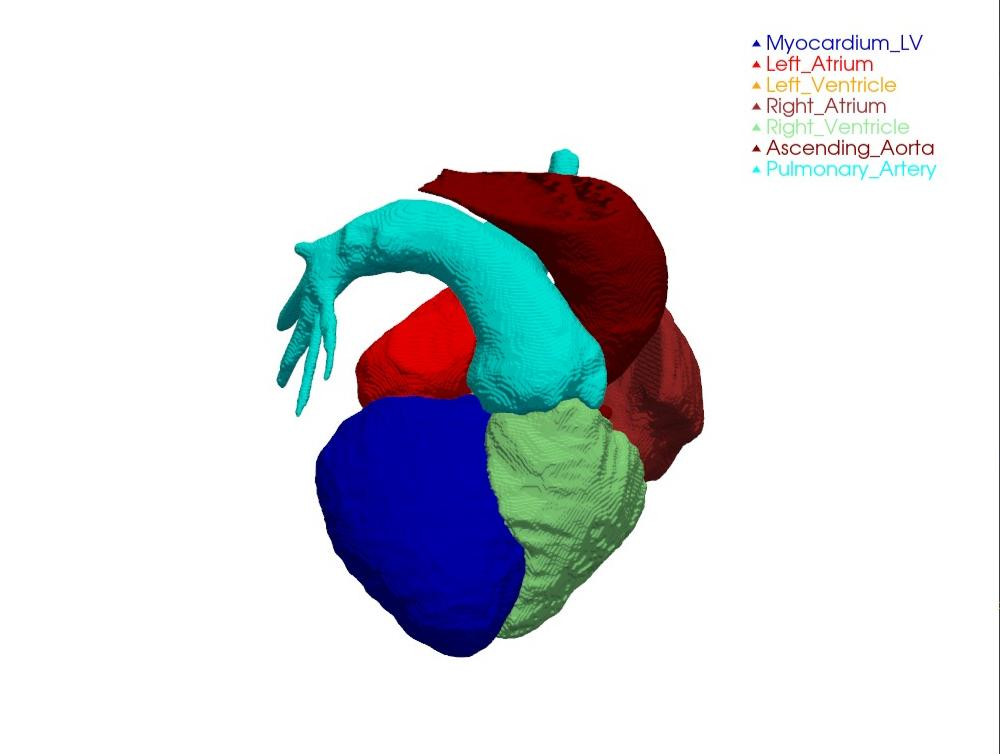
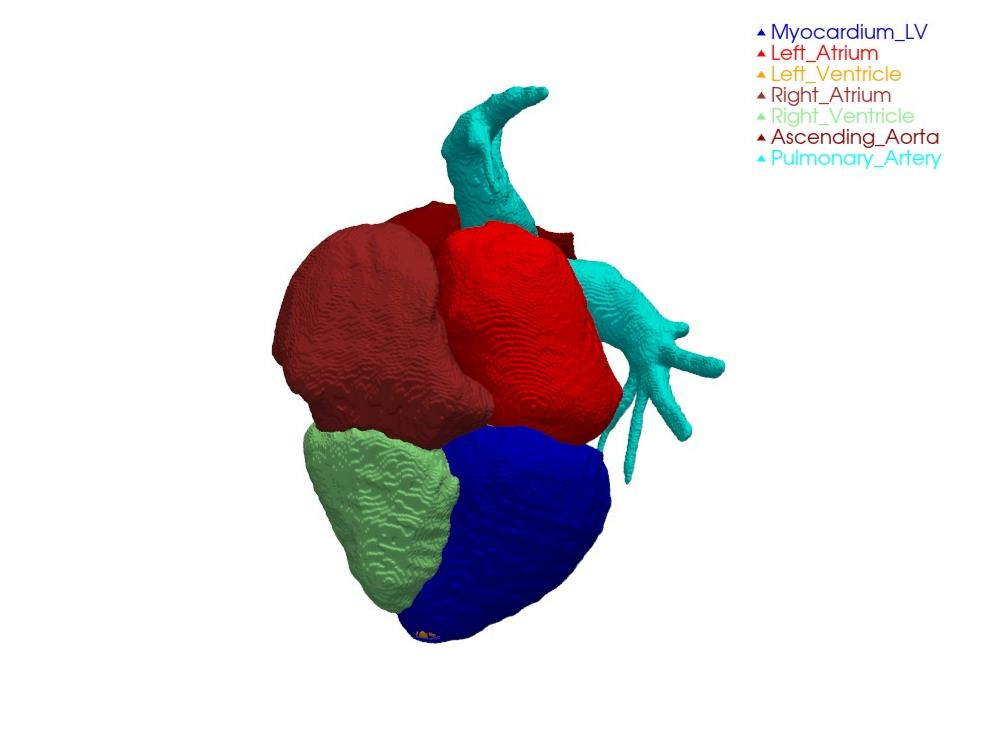
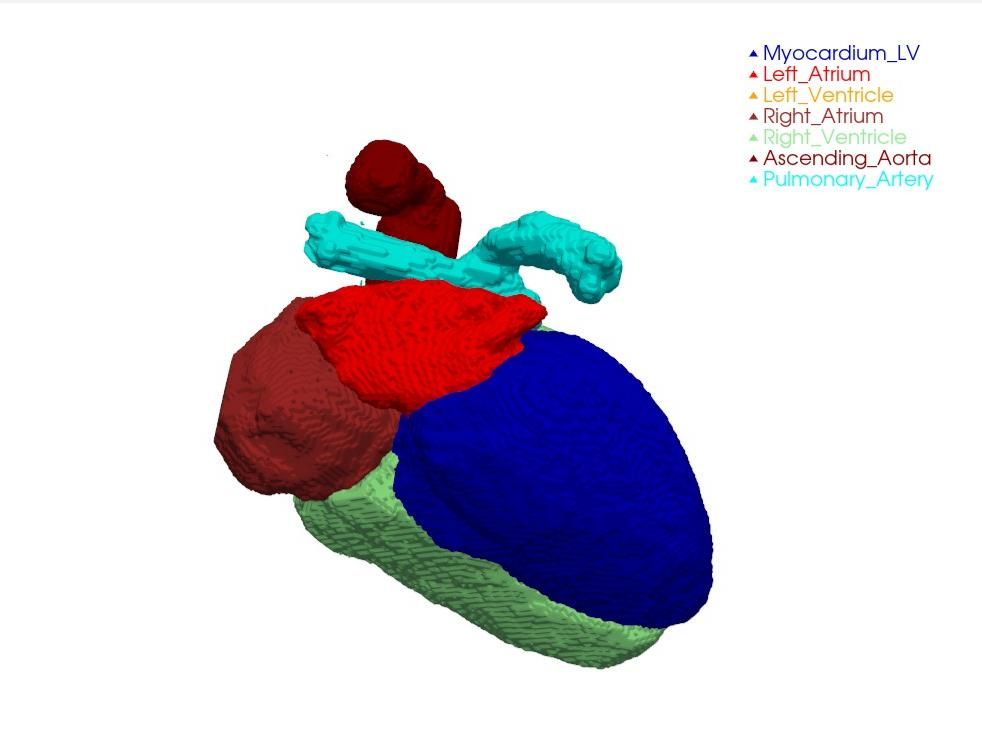
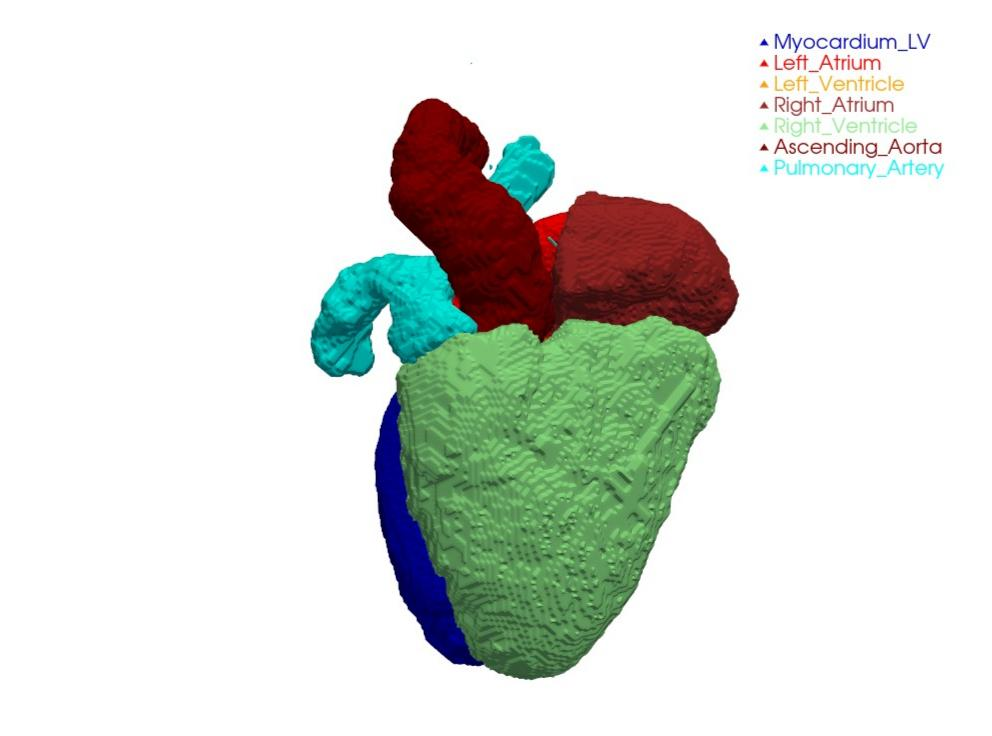

# Transformer-Guided Graph Attention for Direct Cardiac Mesh Reconstruction

**A Structural Digital Twin Framework**

[](https://bcb.acm.org)
[](https://python.org)
[](https://pytorch.org)
[](https://creativecommons.org/licenses/by-nc-nd/4.0/)

> **Published at:** 17th ACM International Conference on Bioinformatics, Computational Biology and Health Informatics (BCB '26), June 30 – July 3, 2026, Rende (CS), Italy
> DOI: [10.1145/3807503.3819477](https://doi.org/10.1145/3807503.3819477)

---

## Overview

We present a novel end-to-end framework that reconstructs anatomically accurate 3D cardiac surface meshes directly from raw CT and MRI volumes — without any post-processing pipeline.

Conventional cardiac mesh generation relies on voxel-level segmentation followed by Marching Cubes, Laplacian smoothing, and manual refinement. This introduces staircase artifacts, topological defects, and a fundamental disconnect between volumetric accuracy (Dice) and mesh quality. **Our method eliminates this entire post-processing chain.**

The architecture couples a **3D Swin Transformer encoder** for hierarchical multi-scale feature extraction with a **Graph Attention Network (GAT) decoder** that directly deforms a smooth template mesh into the patient-specific cardiac geometry. The result is a clinically usable, simulation-ready surface mesh output in a single forward pass.

---

## Architecture

<p align="center">
  
</p>

The pipeline has two parallel streams that converge at the GAT block:

- **Top stream:** Input CT/MRI volume → intensity normalization → **3D Swin Transformer Encoder** (3-stage hierarchical feature extraction at coarse, medium, and fine scales) → multi-scale image features
- **Bottom stream:** Initial mesh template (sphere / mean shape) → **Graph Construction** (vertices V, edges E) → graph structure and initial vertex features
- **GAT Block:** Multi-head graph attention + vertex feature update (MLP) → **Vertex Coordinate Regressor** → Predicted 3D Heart Mesh
- **Training supervision:** Chamfer Distance + Edge Regularization + Laplacian Smoothness losses against Ground Truth Mesh

---

## Reconstructed Results

The model reconstructs **7 cardiac structures simultaneously** from a single CT or MRI scan:

| Color | Structure |
|:---:|---|
| Blue | Myocardium (LV wall) |
| Dark Red | Left Atrium |
| Gold | Left Ventricle |
| Red | Right Atrium |
| Light Green | Right Ventricle |
| Maroon | Ascending Aorta |
| Cyan | Pulmonary Artery |

### CT Reconstructions

<p align="center">
  
  &nbsp;
  
</p>

### MRI Reconstructions

<p align="center">
  
  &nbsp;
  
</p>

---

## Key Contributions

1. **Direct mesh deformation** — predicts vertex coordinates end-to-end; no Marching Cubes, no smoothing, no manual fixes required at inference
2. **Hybrid Swin-GAT architecture** — 3D Swin Transformer captures long-range volumetric context; GAT respects mesh topology during deformation
3. **Multi-modal** — single model trained jointly on CT and MRI; evaluated on the MM-WHS 2017 benchmark
4. **Simulation-ready output** — meshes are smooth and topologically clean by construction, suitable for finite element analysis and digital twin workflows
5. **Competitive mesh quality** — outperforms Marching Cubes baselines on Chamfer Distance and Hausdorff Distance across all 7 structures

---

## Repository Structure

```
.
├── assets/                         # Images used in this README
│   ├── pipeline.png                # Architecture diagram
│   ├── reconstruction_ct_view1.jpeg
│   ├── reconstruction_ct_view2.jpeg
│   ├── reconstruction_mri_view1.jpeg
│   └── reconstruction_mri_view2.jpeg
│
├── model_transformer.py            # 3D Swin Transformer encoder + GAT decoder
├── dataset.py                      # MM-WHS 2017 data loader (CT + MRI)
├── mesh_losses.py                  # Chamfer, Laplacian, and edge loss functions
├── train_gat_deform.py             # Training script (single unified mesh)
├── deform_reconstruct.py           # Inference: CT/MRI → 3D mesh
├── reconstruct_heart.py            # Voxel segmentation + optional mesh visualization
├── evaluate_test_metrics.py        # Evaluation: Dice, Chamfer, Hausdorff
├── ablation_study.py               # Ablation experiments
├── generate_swin_gat_mesh.py       # Generate meshes using Swin-GAT model
├── generate_swin_mesh.py           # Generate meshes using Swin encoder only
├── generate_mc_meshes.py           # Generate Marching Cubes baseline meshes
├── count_params.py                 # Model parameter counting utility
└── requirements.txt
```

---

## Installation

### Prerequisites

- Python 3.9+
- CUDA-capable GPU (recommended: ≥8 GB VRAM)
- CUDA 11.8 or 12.x

### Setup

```bash
git clone https://github.com/abhi29032004/heart.git
cd heart

# Create and activate virtual environment
python -m venv venv
source venv/bin/activate        # Linux/macOS
venv\Scripts\activate           # Windows

# Install PyTorch (CUDA 11.8)
pip install torch torchvision torchaudio --index-url https://download.pytorch.org/whl/cu118

# Install remaining dependencies
pip install -r requirements.txt
```

---

## Dataset

This work evaluates on the **MM-WHS 2017** (Multi-Modality Whole Heart Segmentation) benchmark, which provides paired CT and MRI volumes with 7-structure annotations.

Organize the dataset under `archive/` as follows:

```
archive/
├── ct_train/
│   ├── ct_train_1001_image.nii
│   ├── ct_train_1001_label.nii
│   └── ...
├── ct_test/
│   ├── ct_test_2001_image.nii
│   └── ...
├── mr_train/
│   ├── mr_train_1001_image.nii
│   ├── mr_train_1001_label.nii
│   └── ...
└── mr_test/
    ├── mr_test_2001_image.nii
    └── ...
```

Label voxel values:

| Value | Structure |
|:---:|---|
| 0 | Background |
| 1 | Left Ventricle |
| 2 | Right Ventricle |
| 3 | Left Atrium |
| 4 | Right Atrium |
| 5 | Myocardium |
| 6 | Ascending Aorta |
| 7 | Pulmonary Artery |

---

## Usage

### 1. Train

```bash
python train_gat_deform.py \
  --epochs 100 \
  --lr 1e-4 \
  --w_lap 0.015 \
  --w_edge 0.008 \
  --use_ct \
  --use_mr
```

Key hyperparameters:

| Flag | Default | Description |
|---|---|---|
| `--epochs` | 100 | Training epochs |
| `--lr` | 1e-4 | Learning rate |
| `--w_ch` | 1.0 | Chamfer distance weight |
| `--w_lap` | 0.015 | Laplacian smoothness weight |
| `--w_edge` | 0.008 | Edge length regularization weight |
| `--hidden` | 256 | GAT hidden dimension |
| `--heads` | 4 | GAT attention heads |
| `--layers` | 3 | GAT depth |

### 2. Inference

```bash
python deform_reconstruct.py \
  --input archive/ct_test/ct_test_2001_image.nii \
  --encoder_ckpt checkpoints_transformer/best_model.pth \
  --gat_ckpt checkpoints_transformer/gat_deform_epoch_100.pth \
  --output_dir predictions_transformer
```

### 3. Evaluate

```bash
python evaluate_test_metrics.py \
  --predictions_dir predictions_transformer \
  --labels_dir archive/ct_test
```

Reported metrics: **Dice Similarity Coefficient**, **Chamfer Distance**, **Hausdorff Distance** (per structure and whole-heart aggregate).

---

## Loss Functions

The model is trained with a composite loss:

$$\mathcal{L} = w_{ch} \cdot \mathcal{L}_{Chamfer} + w_{lap} \cdot \mathcal{L}_{Laplacian} + w_{edge} \cdot \mathcal{L}_{Edge}$$

| Loss | Formula | Purpose |
|---|---|---|
| Chamfer | $\frac{1}{|P|}\sum_{p}\min_{q}\|p-q\| + \frac{1}{|Q|}\sum_{q}\min_{p}\|q-p\|$ | Surface accuracy |
| Laplacian | $\sum_i \|v_i - \text{mean}(\mathcal{N}(v_i))\|^2$ | Mesh smoothness |
| Edge | $\sum_{(i,j)} (\|v_i - v_j\| - \ell_0)^2$ | Uniform edge lengths |

---

## Citation

If you use this code or find this work useful, please cite:

```bibtex
@inproceedings{abhishek2026transformer,
  author    = {Abhishek, H S and Ganamukhi, Akash and Suresh, Abhimanyu and
               Hiremath, Aditya G and Honnavalli, Prasad B and Balasubramanyam, Adithya},
  title     = {Transformer-Guided Graph Attention for Direct Cardiac Mesh
               Reconstruction: A Structural Digital Twin Framework},
  booktitle = {Proceedings of the 17th ACM International Conference on
               Bioinformatics, Computational Biology and Health Informatics},
  series    = {BCB '26},
  year      = {2026},
  pages     = {},
  doi       = {10.1145/3807503.3819477},
  publisher = {ACM},
  address   = {Rende (CS), Italy}
}
```

---

## Authors

| Name | Affiliation |
|---|---|
| **Abhishek H S** | CAVE Labs, C-IoT, Dept. of CSE, PES University, Bengaluru |
| Akash Ganamukhi | CAVE Labs, C-IoT, Dept. of CSE, PES University, Bengaluru |
| Abhimanyu Suresh | CAVE Labs, C-IoT, Dept. of CSE, PES University, Bengaluru |
| Aditya G Hiremath | CAVE Labs, C-IoT, Dept. of CSE, PES University, Bengaluru |
| Prasad B Honnavalli | C-IoT, Dept. of CSE, PES University, Bengaluru |
| **Adithya Balasubramanyam** | CAVE Labs, C-IoT, Dept. of CSE, PES University, Bengaluru |

---

## Acknowledgements

This project was carried out as an internally funded initiative with resources available in the CAVE Labs, Center for IoT, PES University, Bengaluru. The Department of Computer Science and Engineering provided us with the necessary administrative and academic support.

---

## License

This work is licensed under [Creative Commons Attribution-NonCommercial-NoDerivatives 4.0 International (CC BY-NC-ND 4.0)](https://creativecommons.org/licenses/by-nc-nd/4.0/).

---

<p align="center">
  <b>CAVE Labs · Center for IoT · PES University · Bengaluru, India</b>
</p>
